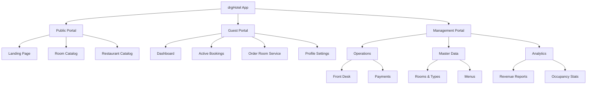
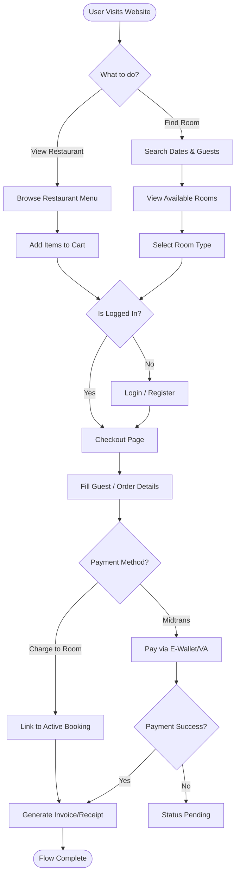
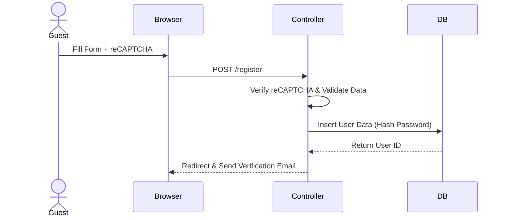
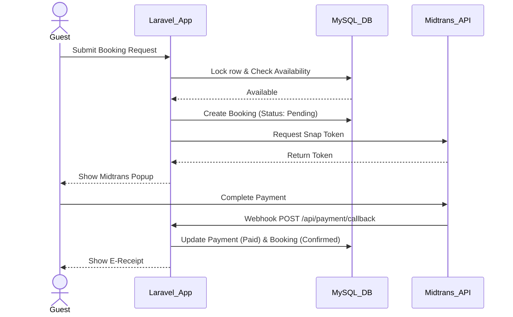
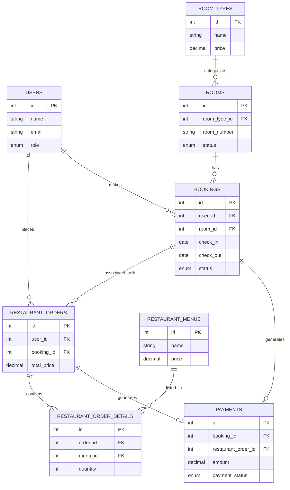
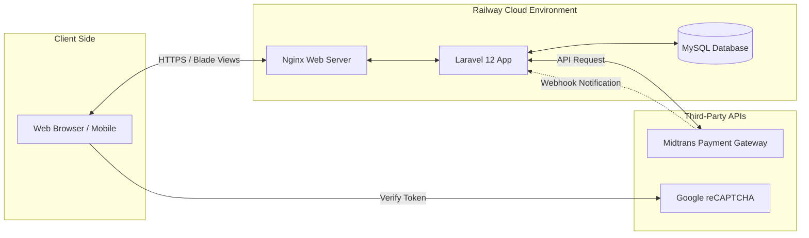

# 📄 Product Requirements Document (PRD) - drgHotel

## 1. Executive Summary
**drgHotel** adalah platform *Property Management System* (PMS) dan *Booking Engine* terintegrasi yang dirancang untuk mendigitalisasi operasional hotel modern. Sistem ini memfasilitasi perjalanan tamu end-to-end, mulai dari pencarian kamar, reservasi online, pembayaran digital via Midtrans, hingga layanan pemesanan restoran (*room service*). Di sisi internal, sistem membekali Resepsionis dengan alat manajemen tamu yang efisien dan memberikan wawasan analitik bisnis yang *real-time* kepada Manajer.

## 2. Product Vision
Menjadi standar emas dalam digitalisasi perhotelan skala menengah, memberikan harmoni sempurna antara pengalaman tamu yang mewah dan kemudahan operasional internal tanpa hambatan (*seamless*).

## 3. Product Mission
* Menghilangkan proses reservasi manual yang rentan terhadap *human error* dan *double booking*.
* Membawa layanan kamar dan restoran langsung ke ujung jari tamu melalui integrasi platform.
* Memberikan transparansi data dan laporan performa bisnis yang akurat bagi pemilik/manajemen hotel.

## 4. Problem Statement
* **Tamu:** Kesulitan memesan kamar secara instan dengan kepastian ketersediaan, serta keterbatasan metode pembayaran pada pemesanan manual (via telepon/WhatsApp).
* **Resepsionis:** Proses *check-in/check-out* yang lambat karena pencatatan kertas atau *spreadsheet*, serta kesulitan menggabungkan tagihan kamar dengan tagihan restoran.
* **Manajer:** Kurangnya visibilitas terhadap tingkat okupansi harian dan laporan pendapatan yang harus direkap secara manual di akhir bulan.

## 5. Business Goals
* **Efisiensi:** Mengurangi waktu proses *check-in* dan *check-out* tamu hingga 70%.
* **Digitalisasi Pembayaran:** Mencapai 90% transaksi *cashless* melalui integrasi *Payment Gateway*.
* **Peningkatan Layanan:** Meningkatkan rasio pemesanan restoran oleh tamu menginap (*cross-selling*) melalui kemudahan pemesanan digital.

## 6. Success Metrics (KPI)
* **System Uptime:** 99.9% (diukur dari *monitoring* Railway).
* **Booking Conversion Rate:** > 60% pengguna yang masuk ke halaman *checkout* menyelesaikan pembayaran.
* **Task Completion Time:** Resepsionis dapat memproses tamu *walk-in* dalam waktu kurang dari 2 menit.
* **Zero Double Booking:** 100% akurasi ketersediaan kamar pada tanggal yang dipilih.

---

## 7. User Personas

### Persona 1: Tamu / Guest (Andi, 28 Tahun, Business Traveler)
* **Goals:** Mencari hotel dengan cepat, memesan tanpa ribet, dan bisa pesan makanan ke kamar lewat HP.
* **Pain Points:** Malas menelpon hotel untuk tanya kamar kosong; tidak suka antre lama di meja resepsionis.
* **Motivations:** Efisiensi waktu, kenyamanan, UI yang terlihat premium dan meyakinkan.

### Persona 2: Resepsionis / Admin (Siti, 24 Tahun, Front Desk Agent)
* **Goals:** Melayani tamu dengan cepat, melihat status kamar (bersih/kotor/isi) dalam satu layar, mencetak tagihan dengan mudah.
* **Pain Points:** Sering bingung merekap tagihan tamu yang makan di restoran tapi belum bayar; takut salah input tanggal *booking*.
* **Motivations:** Sistem yang mudah dipelajari, tidak lemot, dan memiliki *dashboard* ringkas.

### Persona 3: Manajer / Owner (Bapak Budi, 45 Tahun, Hotel Manager)
* **Goals:** Memantau pendapatan harian/bulanan, melihat tingkat okupansi kamar, mengetahui menu restoran terlaris.
* **Pain Points:** Menunggu berhari-hari untuk laporan akhir bulan dari staf akunting.
* **Motivations:** Data *real-time* yang divisualisasikan dalam grafik yang mudah dibaca untuk pengambilan keputusan.

---

## 8. User Roles & Permissions
*Role-Based Access Control (RBAC) Matrix:*

| Fitur / Modul | Guest | Receptionist | Manager |
| :--- | :---: | :---: | :---: |
| Lihat Profil Hotel & Kamar | ✅ | ✅ | ✅ |
| Buat Reservasi | ✅ | ✅ | ✅ |
| Bayar via Midtrans | ✅ | ❌ | ❌ |
| Pesan Makanan Restoran | ✅ | ✅ | ✅ |
| Kelola Master Kamar & Harga | ❌ | ❌ | ✅ |
| Update Status Kamar (Check-in/out) | ❌ | ✅ | ✅ |
| Konfirmasi Pembayaran Manual | ❌ | ✅ | ✅ |
| Lihat Laporan Pendapatan | ❌ | ❌ | ✅ |
| Kelola Akun Pengguna / Staf | ❌ | ❌ | ✅ |

---

## 9. Scope Definition

### MVP Features (Wajib untuk UKK)
* Autentikasi Pengguna (Login, Register, Role Middleware).
* Manajemen Master Data (Tipe Kamar, Kamar, Menu Restoran).
* *Booking Engine* (Pencarian ketersediaan, reservasi, *check-in/out*).
* Integrasi Pembayaran (Midtrans Sandbox).
* Modul Restoran Digital.
* Dashboard Analitik & *Reporting* PDF.

### Future Features (Post-UKK)
* Notifikasi WhatsApp menggunakan API pihak ketiga.
* Fitur ulasan dan *rating* kamar.
* Sistem kode promo / diskon.

### Out of Scope (Tidak Dibangun)
* Modul Akuntansi Jurnal Umum (General Ledger).
* Modul Manajemen Inventaris/Gudang (Bahan baku restoran).

---

## 10. Functional Requirements
* **FR-01 (Auth):** Sistem harus memungkinkan registrasi dengan verifikasi email dan perlindungan Google reCAPTCHA v2.
* **FR-02 (Booking):** Sistem harus dapat memfilter ketersediaan kamar berdasarkan *check-in date*, *check-out date*, dan *room type*.
* **FR-03 (Payment):** Sistem harus menghasilkan *Snap Token* Midtrans dan secara otomatis mengubah status pembayaran via Webhook.
* **FR-04 (Operations):** Sistem harus memungkinkan resepsionis mengubah status kamar dari `available` menjadi `occupied` dan sebaliknya.
* **FR-05 (Restaurant):** Sistem harus dapat mengaitkan tagihan restoran (*restaurant_order_id*) ke tagihan kamar (*booking_id*).
* **FR-06 (Reporting):** Sistem harus dapat mengagregasi data pendapatan dan okupansi per bulan dan menampilkannya menggunakan Chart.js.

## 11. Non Functional Requirements
* **NFR-01 (Performance):** *Time-to-interactive* halaman utama tidak lebih dari 2.5 detik.
* **NFR-02 (Security):** Semua *password* wajib di-hash menggunakan algoritma Bcrypt (bawaan Laravel).
* **NFR-03 (Usability):** Antarmuka 100% *Responsive* mengikuti pendekatan *Mobile First*.
* **NFR-04 (Reliability):** Sistem harus menangani transaksi konkuren untuk mencegah dua tamu mem-booking kamar yang sama di detik yang sama (*Database Transaction & Lock*).

---

## 12. User Stories

| ID | As a... | I want to... | So that... | Acceptance Criteria (AC) |
| :--- | :--- | :--- | :--- | :--- |
| US01 | Guest | mencari kamar kosong berdasarkan tanggal | saya tahu kamar mana yang bisa dipesan. | Filter tanggal berfungsi; Hanya kamar `available` yang tampil. |
| US02 | Guest | melihat detail fasilitas dan harga tipe kamar | saya bisa menyesuaikan dengan *budget*. | Halaman detail menampilkan foto, deskripsi, harga/malam. |
| US03 | Guest | melakukan pembayaran *booking* pakai E-Wallet | saya tidak perlu ke ATM. | *Popup* Midtrans muncul; Status *payment* berubah otomatis ke `paid`. |
| US04 | Guest | memesan makanan dari menu restoran | makanan diantar ke kamar saya. | Menu masuk keranjang; Terhubung ke ID Reservasi aktif. |
| US05 | Guest | melihat riwayat pemesanan saya | saya bisa menunjukkan bukti *booking* saat datang. | Ada halaman *My Bookings*; Menampilkan status reservasi. |
| US06 | Receptionist | melihat daftar tamu yang akan *check-in* hari ini | saya bisa menyiapkan kunci kamar. | Dashboard menampilkan *list booking* berstatus `confirmed`. |
| US07 | Receptionist | melakukan proses *check-in* sistem | status kamar berubah jadi terisi. | Tombol *Check-in* berfungsi; Status kamar di *database* jadi `occupied`. |
| US08 | Receptionist | melakukan *check-out* dan cetak *invoice* | tamu menerima tagihan akhir. | Tombol *Check-out* merubah status kamar ke `available`; PDF *invoice* ter-generate. |
| US09 | Receptionist | memproses pesanan restoran tamu | dapur bisa langsung memasak. | Notifikasi pesanan restoran masuk di dashboard Receptionist. |
| US10 | Receptionist | menambahkan biaya tambahan secara manual | denda kerusakan bisa tercatat. | Form *Add Note/Extra Charge* tersedia di detail *booking*. |
| US11 | Manager | melihat total pendapatan bulan ini | saya tahu performa finansial hotel. | Chart garis menampilkan data yang ditarik dari total `payments`. |
| US12 | Manager | melihat okupansi kamar dalam bentuk grafik | saya tahu tipe kamar apa yang laku. | Pie chart dari Chart.js menampilkan persentase kamar terisi. |
| US13 | Manager | menambah atau mengedit Tipe Kamar | saya bisa menyesuaikan harga *high season*. | Form CRUD Tipe Kamar dengan validasi input berfungsi. |
| US14 | Manager | menambah atau mengedit Menu Restoran | menu baru bisa dijual ke tamu. | Form CRUD Tipe Menu beserta *upload image* berfungsi. |
| US15 | Manager | mengunduh laporan PDF per periode | saya bisa menyimpannya sebagai arsip. | Filter *date range*; File PDF terunduh sempurna. |

---

## 13. Sitemap

```text
/ drgHotel Platform
├── Public Pages
│   ├── Home (Landing Page)
│   ├── Rooms & Pricing
│   │   └── Room Detail & Checkout
│   ├── Restaurant Menu
│   └── About Us & Contact
├── Authentication
│   ├── Login
│   ├── Register
│   └── Forgot Password
├── Guest Area (Logged In)
│   ├── My Dashboard
│   ├── My Bookings History
│   └── Profile & Security Settings
└── Internal Management (Admin/Manager)
    ├── General Dashboard
    ├── Front Desk Operations (Check-in/out)
    ├── Master Data
    │   ├── Room Types Management
    │   ├── Rooms Management
    │   └── Restaurant Menus Management
    ├── Transactions
    │   ├── Booking Records
    │   ├── Restaurant Orders
    │   └── Payments History
    └── Reports & Analytics (Manager Only)

```

---

## 14. Information Architecture



---

## 15. User Flow (Main Application Flow)



---

## 16. System Workflow

### Register Flow



### Booking & Payment Flow



---

## 17. Database Reverse Engineering

Berdasarkan skema PMS standar industri:

1. **`users`**:
* *Purpose:* Menyimpan data autentikasi dan profil pengguna.
* *Relationships:* `hasMany(bookings)`, `hasMany(restaurant_orders)`.
* *Features:* Multi-Auth Login, Register, Role Management.


2. **`room_types`**:
* *Purpose:* Detail katalog kamar.
* *Relationships:* `hasMany(rooms)`.
* *Features:* Katalog produk, penentuan harga dasar.


3. **`rooms`**:
* *Purpose:* Unit fisik kamar hotel.
* *Relationships:* `belongsTo(room_types)`, `hasMany(bookings)`.
* *Features:* Manajemen inventaris kamar, pelacakan status ketersediaan.


4. **`bookings`**:
* *Purpose:* Transaksi inti reservasi hotel.
* *Relationships:* `belongsTo(users)`, `belongsTo(rooms)`, `hasOne(payments)`.
* *Features:* *Booking engine*, riwayat transaksi.


5. **`payments`**:
* *Purpose:* Rekaman finansial terintegrasi *gateway*.
* *Relationships:* `belongsTo(bookings)`, `belongsTo(restaurant_orders)`.
* *Features:* Invoice, Status Midtrans, Laporan Pendapatan.


6. **`restaurant_menus`**:
* *Purpose:* Katalog produk makanan/minuman.
* *Relationships:* `hasMany(restaurant_order_details)`.
* *Features:* Menu interaktif, CRUD item.


7. **`restaurant_orders`** & **`restaurant_order_details`**:
* *Purpose:* Keranjang dan nota pesanan restoran.
* *Relationships:* `belongsTo(bookings)` (opsional), `hasMany(restaurant_order_details)`.
* *Features:* *Room service*, integrasi tagihan tambahan.


---

## 18. Database Design Recommendations

* **Tambahkan tabel `audit_logs`:** Untuk mencatat setiap perubahan status kritis (misal, admin mengubah pembayaran dari pending menjadi paid).
* **Gabungkan Entitas User:** Buat satu tabel `users` dengan enum `role` (`guest`, `receptionist`, `manager`) dibandingkan memisah `guests` dan `users`. Ini akan sangat mempermudah otentikasi di Laravel Breeze.

---

## 19. Eloquent ORM Relationships



---

## 20. API Contract

Terdapat endpoint API untuk komunikasi server-to-server dan interaktivitas frontend.

| Method | Endpoint | Kegunaan | Auth |
| --- | --- | --- | --- |
| `POST` | `/api/midtrans/webhook` | Menerima notifikasi status bayar dari Midtrans | Server Key |
| `GET` | `/api/rooms/check-availability` | Cek ketersediaan kamar secara AJAX | Public |
| `GET` | `/api/analytics/revenue` | Data JSON untuk grafik Chart.js di Dashboard | Manager |

---

## 21. Security Architecture

* **Authentication & Authorization:** Laravel Breeze + Custom Middleware (`CheckRole`) untuk membatasi rute `/admin` dan `/manager`.
* **Google reCAPTCHA v2:** Melindungi form Login dan Register dari ancaman *Bot/Brute Force*.
* **CSRF Protection:** Diwajibkan menggunakan direktif `@csrf` di seluruh form.
* **XSS Protection:** Penggunaan `{{ $data }}` di Blade otomatis melakukan *escaping* (*htmlspecialchars*).
* **SQL Injection:** Eloquent ORM + Query Builder parameter *binding* memastikan tidak ada injeksi SQL.
* **Transaction Locks:** Menggunakan `DB::transaction()` saat proses *booking* agar tidak terjadi *race conditions* (double booking pada milidetik yang sama).

---

## 22. Dashboard Requirements

* **Admin / Receptionist Dashboard:**
* *Widgets:* Kedatangan hari ini, Keberangkatan hari ini, Kamar kotor.
* *Table:* Antrean *check-in* (dengan tombol proses instan).
* *Notifications:* Pesanan *room service* baru yang perlu disiapkan dapur.


* **Manager Dashboard:**
* *Widgets:* Total Pendapatan Bulan Ini, Tingkat Okupansi (%), Jumlah Transaksi Sukses.
* *Charts:* Grafik Garis (Pendapatan Harian) & Grafik Lingkaran (Proporsi Tipe Kamar Terlaris).


## 23. Reporting & Analytics

* **Laporan Pendapatan (PDF/Excel):** Berdasarkan periode tanggal, menarik data dari tabel `payments` yang berstatus `paid`.
* **Laporan Okupansi:** Persentase ketersediaan kamar terjual per hari dalam periode tertentu.
* **Laporan Menu Terlaris:** Menampilkan tren pesanan dari restoran.

---

## 24. UI/UX Design System

* **Design Principles:** Modern, *Luxury Hotel*, *Clean*, *Premium*, *High Whitespace*, *Mobile First*.
* **Color System:**
* *Primary:* `#1A1A1A` (Elegant Black - Teks dan Header).
* *Accent:* `#D4AF37` (Luxury Gold - CTA, Button, Ikonografi).
* *Background:* `#FFFFFF` dan `#F8F9FA` (Clean Minimalist).


* **Typography:**
* *Headings:* **Playfair Display** (Kesan klasik dan mewah).
* *Body:* **Inter** atau **Roboto** (Keterbacaan maksimal di layar).


* **Komponen:** Tanpa gradien, desain rata (flat) dengan bayangan halus (*soft drop shadow*), sudut sedikit melengkung (border-radius 4-6px).

---

## 25. Technical Architecture



---

## 26. Risks & Mitigation

| Risiko | Dampak | Strategi Mitigasi |
| --- | --- | --- |
| **Koneksi Webhook Gagal** | Status pembayaran Midtrans tidak terupdate. | Fitur "Sync Status" di panel Admin untuk hit API Midtrans secara manual. |
| **Double Booking** | Kamar yang sama dipesan 2 orang bersamaan. | Implementasi *Pessimistic Locking* di Database saat validasi ketersediaan. |
| **Downtime Saat Presentasi** | Sistem tidak bisa diakses penguji UKK. | Deploy awal dan tes beban ringan di Railway, siapkan localhost XAMPP sebagai backup. |

---

## 27. Development Roadmap (Estimasi 4 Minggu)

* **Minggu 1:** Inisialisasi Proyek Laravel, Database Migration & Seeding, Setup Breeze Multi-Auth, CRUD Master Data.
* **Minggu 2:** Pembuatan UI/UX Landing Page, Algoritma Pencarian Ketersediaan Kamar, Alur Checkout Reservasi.
* **Minggu 3:** Integrasi Midtrans API (Sandbox), Fitur Check-in/out Resepsionis, Modul Restoran.
* **Minggu 4:** Integrasi Chart.js, Ekspor Laporan PDF (DomPDF), Uji Coba QA, Deployment Railway.

## 28. Future Enhancements

* Integrasi *WhatsApp Gateway* (Fonnte/Watzap) untuk pengiriman e-receipt otomatis.
* Modul Loyalitas Pelanggan (Point System).
* Dukungan *Keyless Entry* melalui *QR Code Scanner*.

## 29. Deployment Strategy

* **Platform:** Railway (App & Managed MySQL).
* **Workflow:** GitHub CI/CD terintegrasi. Setiap push ke branch `main` memicu *auto-build* dan *auto-deploy* di Railway.
* **Backup:** Export SQL manual berkala atau via fitur backup bawaan Railway (jika tersedia di paket yang digunakan).

---

## 30. Final Project Summary

Dokumen PRD **drgHotel** ini dirancang dengan pendekatan *enterprise-ready*. Dengan mengkombinasikan teknologi mumpuni (Laravel 12, Midtrans), desain UI premium, dan arsitektur database terstruktur dengan ORM, proyek ini siap mencetak nilai sempurna pada sidang UKK serta layak dijadikan portofolio profesional untuk industri *Software Engineering*.